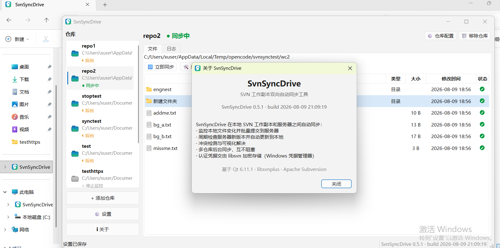
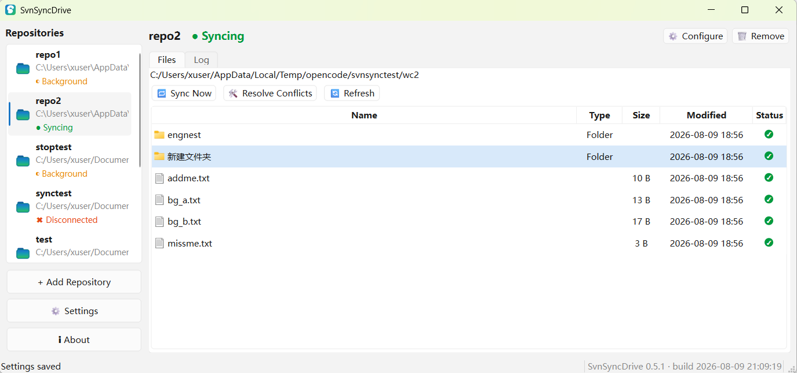

# SvnSyncDrive

**中文**

SvnSyncDrive 是一款跨平台桌面客户端，让本地文件夹与 Subversion 仓库保持**双向实时同步**：它监听工作副本、自动添加未纳入版本控制的新文件、提交本地更改，并拉取远端更新——内置冲突检测与凭据加密存储。界面支持中英文切换（设置 → 常规 → 语言）。

**English**

SvnSyncDrive is a cross-platform desktop client that keeps local folders in **two-way live sync** with Subversion repositories: it watches working copies, auto-adds unversioned files, commits changes, and pulls remote updates — with conflict detection and encrypted credential storage. The UI language switches between Chinese and English (Settings → General → Language).

Built with C++17 + Qt 6 (Widgets), on top of [LibSVNPlus](https://github.com/vxling/LibSVNPlus), a thin C++ wrapper around the Subversion C API.

## 截图 / Screenshots





## 功能 / Features

- **向上同步（本地 → 服务器）**：监听工作副本，对未纳入版本控制的文件自动执行 `svn add`，并按目录（最深优先）批量提交版本控制的修改。  
  **Upward sync (local → server)**: watches the working copy, auto-runs `svn add` on unversioned files and commits versioned changes (grouped by directory, deepest first).
- **向下同步（服务器 → 本地）**：轮询服务器 HEAD，通过 `svn status -u` 发现远端变更，再分块 `svn update` 更新工作副本（最深目录优先）。  
  **Downward sync (server → local)**: polls the server HEAD, discovers remote changes via `svn status -u`, and updates the working copy in chunks (deepest directory first).
- **定时全量同步**：周期性全树 `svn update` + 全量向上扫描，作为边缘情况的安全网。  
  **Full sync on a timer**: periodic whole-tree `svn update` + full upward scan as a safety net for edge cases.
- **冲突处理**：默认将冲突在对话框中列出解决；也可配置自动按默认方式解决（树冲突一律保留当前工作副本状态）。  
  **Conflict handling**: conflicts are detected and surfaced in a dialog by default; optionally auto-resolved with a configurable default choice (tree conflicts always keep the working copy state).
- **每仓库独立引擎**：每个仓库拥有独立的监听器、工作线程与定时器——一个慢仓库不会阻塞其他仓库。  
  **Per-repository engine**: every repo gets its own watcher, worker thread, and timers — one slow repo never blocks another.
- **抗断网设计**：单命令网络超时 + 工作线程看门狗，可配置断网判定阈值，快速标记失联服务器。  
  **Resilient networking**: per-command network timeouts with a worker watchdog, and a configurable disconnect threshold that flags dead servers quickly.
- **系统托盘集成**：可最小化到托盘，后台同步持续运行。  
  **System tray integration**: run minimized to the tray so background sync keeps going.
- **凭据不入应用配置**：交由 libsvn 自带的加密认证缓存保管。  
  **Credentials never stored in app config**: delegated to libsvn's own encrypted auth cache.
- **单实例**：再次启动只会聚焦已运行的窗口。  
  **Single instance**: a second launch just focuses the already-running window.
- **自包含发布包**：每个发布包都带上与之编译匹配的 libsvn 运行库。  
  **Self-contained bundles**: every artifact ships the exact libsvn it was built against.

## 下载 / Download

从 [Releases](https://github.com/vxling/SvnSyncDrive/releases) 获取最新版本：

Grab the latest release from [Releases](https://github.com/vxling/SvnSyncDrive/releases):

| 平台 Platform | 构件 Artifacts |
|---|---|
| Windows x64 | portable zip · per-user MSI installer |
| Linux x86_64 | tar.gz bundle · `.deb` package |
| macOS arm64 | `.dmg` (built by CI) |

## 安装 / Installation

### Windows

- **MSI（推荐）**：双击 `SvnSyncDrive-<version>-win64.msi`，**按用户**安装，无需管理员权限。注意：按用户安装只对安装它的账户生效。  
  **MSI (recommended)**: double-click `SvnSyncDrive-<version>-win64.msi`. It installs **per-user** — no administrator rights required. Note the per-user installation is tied to the account that installs it.
- **便携 zip**：解压到任意位置，直接运行 `SvnSyncDrive.exe`。  
  **Portable zip**: unpack anywhere and run `SvnSyncDrive.exe`.

### Linux

Debian/Ubuntu 系优先使用 `.deb`：

Prefer the `.deb` for Debian/Ubuntu-family systems:

```bash
sudo apt install ./svnsyncdrive_<version>_amd64.deb
```

> **Ubuntu 25.10 及以上提示**：在 GNOME Software 中双击 `.deb` 会因签名/认证错误被阻止——25.10 起 Software 应用会校验第三方 `.deb` 并拒绝未签名包。请在终端用 `sudo apt install ./...` 安装（或 `sudo dpkg -i` 后 `sudo apt -f install`），终端安装不进行旁加载签名校验。旧版 Ubuntu 双击安装仍可用。  
> **Note for Ubuntu 25.10 and newer:** double-clicking the `.deb` in GNOME Software is blocked with a signature/authentication error — since 25.10 the Software app verifies third-party `.deb` files and refuses unsigned packages. Install from the terminal with `sudo apt install ./...` (or `sudo dpkg -i` followed by `sudo apt -f install`), which does not apply the sideload signature check. On older Ubuntu versions double-clicking still works.

便携 **tar.gz** 包无需安装：

The portable **tar.gz** bundle needs no installation:

```bash
tar -xzf svnsyncdrive-<version>-linux64.tar.gz
cd svnsyncdrive-<version>-linux64
./svnsyncdrive.sh
```

### macOS

打开 `.dmg` 并将应用拖入 *应用程序*。应用仅做了 ad-hoc 签名（无 Apple Developer ID），首次启动需在访达中右键选择 **打开** 以绕过 Gatekeeper。

Open the `.dmg` and drag the app to *Applications*. The app is only ad-hoc signed (no Apple Developer ID), so on first launch right-click it in Finder and choose **Open** to bypass Gatekeeper.

## 操作系统文件管理器的状态图标 / File status icons in the OS file manager

SvnSyncDrive 在其内置文件浏览器中显示 SVN 状态图标，但**不**为操作系统文件管理器（资源管理器 / Finder / Nautilus）添加状态角标。Shell 覆盖图标与各操作系统强耦合且数量受限（Windows 全系统仅 15 个覆盖槽位；现代 GNOME 的 Nautilus 已移除 emblem API；Finder 徽标需要单独签名的 Swift 扩展）。为桌面客户端按平台构建和维护这些不划算。

SvnSyncDrive shows SVN status icons inside its own file browser, but it does **not** add status overlays to the OS file manager (Explorer / Finder / Nautilus). Shell icon overlays are platform-specific, tightly coupled to each OS, and hard-limited by the OS (Windows exposes only 15 overlay slots system-wide; Nautilus removed its emblem API on modern GNOME; Finder badges require a separately-signed Swift extension). Building and maintaining that per platform is not worth it for a desktop client.

**Windows** 上可安装 [TortoiseSVN](https://tortoisesvn.net/) 直接在资源管理器获得 SVN 状态覆盖图标——它读取同一份 `svn` 工作副本，无需额外配置：

On **Windows**, install [TortoiseSVN](https://tortoisesvn.net/) to get SVN status overlays directly in Explorer — it reads the same `svn` working copies and requires no extra configuration:

1. 安装 TortoiseSVN（若覆盖图标被隐藏，在其设置中启用 "Show overlay icons"——覆盖槽位与 Dropbox/OneDrive 等工具共享）。  
   Install TortoiseSVN (use "Show overlay icons" from its settings if overlays are hidden — overlay slots are shared with Dropbox/OneDrive/other tools).
2. 其资源管理器覆盖图标与列提供器对任意 SVN 工作副本生效，包括 SvnSyncDrive 管理的工作副本。  
   Its Explorer overlays and column providers work on any SVN working copy, including ones managed by SvnSyncDrive.

**macOS** 与 **Linux** 上无法实际使用资源管理器式覆盖图标，请依赖 SvnSyncDrive 文件浏览器内的状态图标。

On **macOS** and **Linux**, Explorer-style overlays are not practically available; rely on the status icons inside SvnSyncDrive's file browser instead.

## 快速开始 / Quick start

1. 启动 SvnSyncDrive。  
   Launch SvnSyncDrive.
2. 点击 **+ 添加仓库**。  
   Click **+ Add Repository**.
3. 输入名称、本地工作副本路径（不存在则自动创建）与仓库 URL，例如 `https://svn.example.com/repo/project`。  
   Enter a name, the local working-copy path (created automatically if missing), and the repository URL — e.g. `https://svn.example.com/repo/project`.
4. 可选择性输入凭据并点击 **测试连接** 校验。  
   Optionally enter credentials and click **Test Connection** to verify.
5. 若目录为空，应用会自动检出全新的工作副本，然后开始同步。  
   The app checks out a fresh working copy if the directory is empty, then starts syncing.

运行后每个仓库持续在后台同步。关闭窗口（或勾选 **启动时最小化到系统托盘**）可将其驻留系统托盘。

Once running, each repository keeps syncing in the background. Close the window (or start with **Start minimized to tray**) to keep it in the system tray.

## 工作原理 / How it works

- 每个仓库拥有独立的 **SyncEngine**（GUI 线程上），管理一个 **RepoWatcher**（文件系统事件）与一个 **SvnWorker**（专用单线程执行全部 SVN 调用，避免 libsvn 客户端并发使用）。  
  Every repository has an independent **SyncEngine** (on the GUI thread) owning a **RepoWatcher** (filesystem events) and an **SvnWorker** (a single dedicated thread that runs all SVN calls, so the libsvn client is never used concurrently).
- **向上**：监听器批量收集文件变更 → 本地 `svn status` 扫描 → （可选）对未版本控制文件执行 `svn add` → 按目录提交。  
  **Upward**: watcher batches file changes → a local `svn status` scan → `svn add` unversioned files (optional) → commit by directory.
- **向下**：轮询定时器对比工作副本修订号与服务器 HEAD → `GetServerUpdatePaths`（`svn status -u`）→ 分块 `svn update`。  
  **Downward**: a poll timer compares the working-copy revision with the server HEAD → `GetServerUpdatePaths` (`svn status -u`) → chunked `svn update`.
- 结果通过队列信号回到 GUI 线程。  
  Results are marshalled back to the GUI thread via queued signals.

完整架构、数据布局与其中的设计决策/坑位见 [docs/DESIGN.md](docs/DESIGN.md)。

The full architecture, data layout, and the decisions/pitfalls behind it live in [docs/DESIGN.md](docs/DESIGN.md).

## 数据存储 / Data storage

所有数据保存在 `~/.svnsyncdrive` 下：

Everything is kept under `~/.svnsyncdrive`:

| 文件 File | 内容 Content |
|---|---|
| `config.db` | SQLite：仓库列表 + 全局设置（含界面语言） |
| `logs.db` | SQLite：每仓库同步历史 |
| `svnsyncdrive.log` | 程序日志（滚动） |

设置（均可在 **设置 / Settings** 中修改）：轮询周期、全量提交周期、自动添加新文件、信任自签名证书、关闭最小化到托盘、每仓库保留日志条数、断网判定阈值、网络超时，以及自动解决冲突及其默认处理方式，还有界面语言。

Settings (all changeable in **设置 / Settings**): poll interval, full-sync interval, auto-add unversioned files, trust self-signed certificates, minimize to tray, logs kept per repo, disconnect threshold, network timeout, auto-resolve conflicts with a default resolution choice, and the UI language.

## 从源码构建 / Building from source

依赖：CMake 3.24+、C++17 编译器（MSVC / GCC / Clang）、Qt 6.5+（Widgets、Network、Sql），以及已 stage 的 [LibSVNPlus](https://github.com/vxling/LibSVNPlus) 安装。

Requirements: CMake 3.24+, a C++17 compiler (MSVC / GCC / Clang), Qt 6.5+ (Widgets, Network, Sql), and a staged [LibSVNPlus](https://github.com/vxling/LibSVNPlus) install.

```bash
cmake -B build -S . -DCMAKE_BUILD_TYPE=Release \
    -DLIBSVNPLUS_ROOT=/path/to/libsvnplus/stage
cmake --build build
```

- `LIBSVNPLUS_ROOT` 指向包含 `include/` 与 `lib/` 布局的 libsvnplus stage 安装（Windows 上还有 `bin/` 下的运行库 DLL）。  
  `LIBSVNPLUS_ROOT` points at a staged libsvnplus install with an `include/` and `lib/` layout (on Windows also the runtime DLLs under `bin/`).
- Windows 上，除非设置了 `OPENSSL_ROOT_DIR`，否则通过 LibSVNPlus 的 vcpkg 树自动定位 OpenSSL。  
  On Windows, OpenSSL is located automatically via the LibSVNPlus vcpkg tree unless `OPENSSL_ROOT_DIR` is set.
- Windows 上目标会自动运行 `windeployqt` 并把 libsvn 运行库 DLL 复制到可执行文件旁。  
  On Windows the target auto-runs `windeployqt` and copies the libsvn runtime DLLs next to the executable.

### 打包 / Packaging

- Windows：`scripts/publish-win.ps1`（便携 zip + WiX 按用户 MSI）。  
  Windows: `scripts/publish-win.ps1` (portable zip + WiX per-user MSI).
- Linux：`scripts/publish-linux.sh`（tar.gz + deb）。  
  Linux: `scripts/publish-linux.sh` (tar.gz + deb).
- macOS：`scripts/publish-macos.sh`；CI 工作流 [macos.yml](.github/workflows/macos.yml) 在 `v*` 标签推送时构建并附加 `.dmg`。  
  macOS: `scripts/publish-macos.sh`; the CI workflow [macos.yml](.github/workflows/macos.yml) builds and attaches the `.dmg` on `v*` tag pushes.

## 测试 / Testing

`synccoretest` 运行单元测试，并可选对真实仓库做集成测试：

`synccoretest` runs unit tests plus optional live integration tests against a real repo:

```bash
# 仅单元测试 / Unit tests only
./build/synccoretest

# 双向实时回归（构建仓库 + 两个工作副本）
# Two-way live regression (builds a repo + two working copies)
powershell -ExecutionPolicy Bypass -File scripts/live-sync-test.ps1
```

也可以尝试 `SvnSyncDrive --repo <wc> <url> [user] [pass]` 做单仓库近似无界面的实时运行。

Also try `SvnSyncDrive --repo <wc> <url> [user] [pass]` for a single-repo headless-ish live run.

## 许可证 / License

许可证尚未声明——本仓库尚无 `LICENSE` 文件。分发前请添加。

The license is not yet declared — no `LICENSE` file exists in this repository. Add one before distributing.
